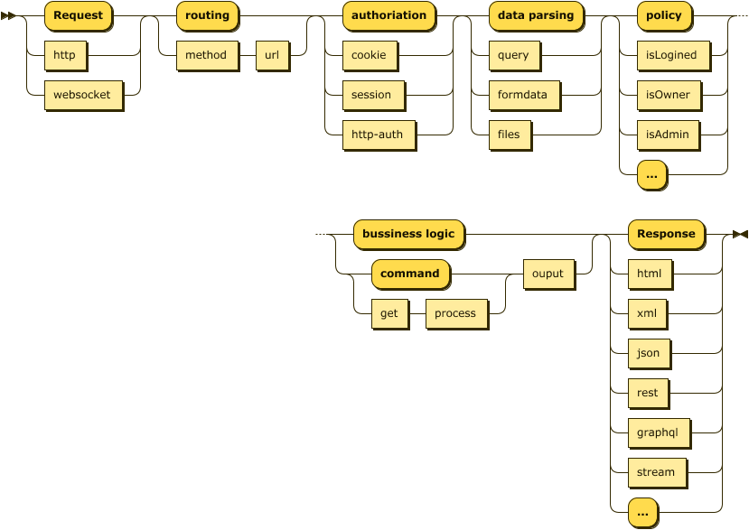

[](https://travis-ci.com/calidion/aex)
[](https://coveralls.io/github/calidion/aex?branch=master)
[](http://opensource.org/licenses/MIT)

[![NPM version][npm-image]][npm-url]
[![Downloads][downloads-image]][npm-url]
[![Downloads][downloads-image-month]][npm-url]
[![Dependency Status][daviddm-image]][daviddm-url]

# AEX

A simple, easy to use, decorated, scoped, object-oriented web server, with async linear middlewares and no more callbacks in middlewares.

It is a web framework for typescript and nodejs.

It is also an example:

1. To show that callbacks are not needed with promise/async/await.
2. To use middlewares in a linear way instead of stacked way which is insecure.

   > For the stacked middleware model will carry response back to the top most so called middleware pushed, where every middleware can access to the body returned.

3. To pass some vairiables through middlewares and to the final handler.

# Philosophy

1. Keep in mind to separate web logic from business logic, and only develope for web logic.
2. Focus soly on web flow.
3. Simplify the way to make good web projects.
4. Consider web interactions as phrased straight lines, which we call it Web Straight Line.
5. No MVC, soly focusing on architecture which is the web logic.

# What is Web Straight Line?

Web Straight Line is used to describe the phrases of the processes on the http/web request.

It can be breifly describe as the following diagram:

> The Web Staight Line



# Content

1. [Install](#install)
2. [Quick Start](#quick-start)
3. [Framework functions](#framework-functions)
4. [Decorators](#decorators)
5. [Usage with no decorators](#usage-with-no-decorators)
6. [Middlewares](#middlewares)
7. [Scope](#scope)
8. [Express Middleware Integration](#use-middlewares-from-expressjs)
9. [Get the web server](#accessable-members)
10. [Websocket support](#websocket-support)

## Shortcuts for decorators

1. [HTTP method decorators](#1-http-method-decorators) (`@http`,  `@get`,  `@post`)

2. [Data parsing decorators](#2-data-parsing-decorators) (`@formdata`,  `@query`,  `@body`)
3. [Static file serving decorators](#3-static-file-serving-decorators) (`@serve`)
4. [Session management decorators](#4-session-management-decorators) (`@session`)
5. [Data filtering and validation decorators](#5-data-filtering-and-validation-decorators) ( `@filter`)
6. [Error definition decorators](#6-error-definition-decorators) (`@error`)
7. [Custome middleware decorators](#7-custome-middleware-decorators) (`@inject`)

# Install

if you use npm

``` sh
npm install @aex/core # or npm i @aex/core
```

or if you use yarn

``` sh
yarn add @aex/core
```

# Quick Start

1. Use `@http` to enable a class with web ability

    ``` ts
    import { Aex, http } from "@aex/core";

    class HelloAex {
      private name = "Alice";
      constructor(name: string) {
        this.name = name;
      }
      @http("*", "*")
      public all(_req: any, res: any, _scope: any) {
        res.end("Hello from " + this.name + "!");
      }
    }
    ```

2. Create an aex instance

    ``` ts
    const aex = new Aex();
    ```

3. Push your class to aex with parameters if you

    ``` ts
    // push your handler into aex with constructor parameters in order
    aex.push(HelloAex, "Eric");
    ```

4. Prepare aex enviroment

    ``` ts
    aex.prepare();
    ```

5. Start aex web server

    ``` ts
    aex.start(8080).then();
    // or
    await aex.start(8080);
    ```

# Framework functions

The aex object has many functions for middlewares and classes.

They are:

1. [use](#use)          add a middleware
2. [push](#push)        push a class
3. [prepare](#prepare)  prepare the server
4. [start](#start)      start the server

## use

Add middlewares to aex, see detailed explanations in [middlewares](#middlewares). These middlewares will be global to all http requests.

## push

push a controller class to aex, it takes on parameter and other arguments:

1. aClass: a class prototype.
2. args: takes the rest arguments for the class constructor

``` ts
aex.push(HelloAex);
//or
aex.push(HelloAex, parameter1, parameter2, ..., parameterN);
// will be invoked as `new HelloAlex(parameter1, parameter2, ..., parameterN)`
```

## prepare

`prepare` is used here to init middlewares and business controllers if controllers are pushed into the `aex` instance. It takes no parameter and return the `aex` instance. so you can invoke the `start` function of aex.
Aex itself has no mvc concepts, aex has the Web Straight Line concept that process all things on the line for each request.

``` ts
await aex.prepare().start();
// or
aex
  .prepare()
  .start()
  .then(() => {
    // further processing
  });
```

## start

`start` function is used to bootstrap the server with cerntain port. It takes three parameters:

1. `port` the port taken by the web server, default to 3000
2. `ip` the ip address where the port bind to, default to localhost
3. `prepare` prepare middlewares or not, used when middlewares are not previously prepared

# Decorators

Aex is simplified by decorators, so you should be familiar with decorators to full utilize aex.

Decorators will be enriched over time. Currently aex provides the following decorators:

1. [HTTP method decorators](#1-http-method-decorators) (`@http`,  `@get`,  `@post`)

2. [Data parsing decorators](#2-data-parsing-decorators) (`@formdata`,  `@query`,  `@body`)
3. [Static file serving decorators](#3-static-file-serving-decorators) (`@serve`)
4. [Session management decorators](#4-session-management-decorators) (`@session`)
5. [Data filtering and validation decorators](#5-data-filtering-and-validation-decorators) ( `@filter`)
6. [Error definition decorators](#6-error-definition-decorators) (`@error`)
7. [Custome middleware decorators](#7-custome-middleware-decorators) (`@inject`)

## 1. HTTP method decorators

This decorators are the most basic decorators, all decorators should follow them. They are
`@http` , `@get` , `@post` .

### `@http` , `@get` , `@post`

`@http` is the generic http method decorator. `@get` , `@post` are the shortcuts for `@http` ; 

The `@http` decorator defines your http handler with a member function.

The member methods are of `IAsyncMiddleware` type.

`@http` takes two parameter:

1. http method name(s)
2. url(s);

You can just pass url(s) if you use http `GET` method only or you can use `@get` .

Here is how your define your handlers.

``` ts
import { http, get, post } from "@aex/core";

class User {
  @http("get", ["/profile", "/home"])
  profile(req, res, scope) {}

  @http(["get", "post"], "/user/login")
  login(req, res, scope) {}

  @http("post", "/user/logout")
  logout(req, res, scope) {}

  @http("/user/:id")
  info(req, res, scope) {}

  @http(["/user/followers", "/user/subscribes"])
  followers(req, res, scope) {}

  @get(["/user/get", "/user/gets"])
  rawget(req, res, scope) {}

  @post("/user/post")
  rawpost(req, res, scope) {}
}
```

## 2. Data parsing decorators

These decorators will parse all data passed thought the HTTP protocol.
They are `@formdata` , `@query` , `@body` .

1. `@formdata` can parse `mulit-part` formdata such as files into `scope.files` and other formdata into `scope.body`. When parsed, you can retrieve your `multi-part` formdata from `scope.files`,  `scope.body`.
2. `@query` can parse url query into `scope.query`.
3. `@body` can parse some simple formdata into `scope.body`.

### `@formdata`

Decorator `@formdata` is a simplified version of node package [ `busboy` ](https://github.com/mscdex/busboy) for `aex` , only the `headers` options will be auto replaced by `aex` . So you can parse valid options when necesary.
All uploaded files are in array format, and it parses body as well.

``` ts
import { http, formdata } from "@aex/core";

class Formdata {
  protected name = "formdata";

  @http("post", "/file/upload")
  @formdata()
  public async upload(_req: any, res: any, scope: any) {
    const { files, body } = scope;

    // Access your files
    const uploadedSingleFile = files["fieldname1"][0];
    const uploadedFileArray = files["fieldname2"];

    // Access your file info

    uploadedSingleFile.temp; // temporary file saved
    uploadedSingleFile.filename; // original filename
    uploadedSingleFile.encoding; // file encoding
    uploadedSingleFile.mimetype; // mimetype

    // Access none file form data
    const value = body["fieldname3"];
    res.end("File Uploaded!");
  }
}
```

### `@body`

Decorator @body provides a simple way to process data with body parser. It a is a simplified version of node package [body-parser](https://github.com/expressjs/body-parser).

It takes two parameters:

1. types in ["urlencoded", "raw", "text", "json"]
2. options the same as body-parser take.

then be parsed into `scope.body` , for compatibility `req.body` is still available.

Simply put:

``` ts
@body("urlencoded", { extended: false })
```

Full example

``` ts
import { http, body } from "@aex/core";

class User {
  @http("post", "/user/login")
  @body("urlencoded", { extended: false })
  login(req, res, scope) {
    const { body } = scope;
  }

  @http("post", "/user/logout")
  @body()
  login(req, res, scope) {
    const { body } = scope;
  }
}
```

### `@query`

Decorator @query will parse query for you. After decorated with `@query` you will have `scope.query` to use. `req.query` is available for compatible reasion, but it is discouraged.

``` ts
class Query {
  @http("get", "/profile/:id")
  @query()
  public async id(req: any, res: any, _scope: any) {
    // get /profile/111?page=20
    req.query.page;
    // 20
  }
}
```

## 3. Static file serving decorators

Aex provides `@serve` decorator for static file serving.

### `@serve`

Decorator `@serve` provides a simple way to serve static files. It a is a simplified version of node package [serve-staticserve-static](https://github.com/expressjs/serve-static).

It takes two parameters:

1. url: the base url for your served files.
2. options: exact options package `serve-static` takes.

then inside the member function you should return the absolute path of of the root of the static files.

``` ts
import { serve } from "@aex/core";

class StaticFileServer {
  protected name = "formdata";

  @serve("/assets")
  public async upload() {
    return resolve(__dirname, "./fixtures");
  }
}
```

## 4. Session management decorators

Aex provides `@session` decorator for default cookie based session management.
Session in other format can be realized with decorator `@inject` .

### `@session`

Decorator `@session` takes a store as the parameter. It is an object derived from the abstract class ISessionStore. which is defined like this:

``` ts
export declare abstract class ISessionStore {
    abstract set(id: string, value: any): any;
    abstract get(id: string): any;
    abstract destroy(id: string): any;
}
```

`aex` provides two default store: `MemoryStore` and `RedisStore` .
`RedisStore` can be configurated by passing options through its constructor. The passed options is of the same to the function `createClient` of the package `redis` . You can check the option details [here](https://github.com/NodeRedis/node-redis#options-object-properties)

For `MemoryStore` , you can simply decorate with `@session()` .
For `RedisStore` , you can decorate with an RedisStore as `@session(redisStore)` . Be sure to keep the variable redisStore global, because sessions must share only one store.

``` ts
// Must not be used @session(new RedisStore(options)).
// For sessions share only one store over every request.
// There must be only one object of the store.
const store = new RedisStore(options); 
class Session {
  @post("/user/login")
  @session()
  public async get(req, res, scope) {
    const {session} = scope;
    session.user = user;
  }

  @get("/user/profile")
  @session()
  public async get(req, res, scope) {
    const {session} = scope;
    const user = session.user;
    res.end(JSON.stringify(user));
  }

  @get("/user/redis")
  @session(store)
  public async get(req, res, scope) {
    const {session} = scope;
    const user = session.user;
    res.end(JSON.stringify(user));
  }
}
```

> Share only one store object over requests.

## 5. Data filtering and validation decorators

Aex provides `@filter` to filter and validate data for you.

### `@filter`

Decorator `@filter` will filter `body` , `params` and `query` data for you, and provide fallbacks respectively for each invalid data processing.

Reference [node-form-validator](https://github.com/calidion/node-form-validator) for detailed usage.

``` ts
class User {
  private name = "Aex";
  @http("post", "/user/login")
  @body()
  @filter({
    body: {
      username: {
        type: "string",
        required: true,
        minLength: 4,
        maxLength: 20
      },
      password: {
        type: "string",
        required: true,
        minLength: 4,
        maxLength: 64
      }
    },
    fallbacks: {
      body: async(error, req, res, scope) {
        res.end("Body parser failed!");
      }
    }
  })
  public async login(req: any, res: any, _scope: any) {
    // req.body.username
    // req.body.password
  }

  @http("get", "/profile/:id")
  @body()
  @query()
  @filter({
    query: {
      page: {
        type: "numeric",
        required: true
      }
    },
    params: {
      id: {
        type: "numeric",
        required: true
      }
    },
    fallbacks: {
      params: async function (this: any, _error: any, _req: any, res: any) {
        this.name = "Alice";
        res.end("Params failed!");
      },
    }
  })
  public async id(req: any, res: any, _scope: any) {
    // req.params.id
    // req.query.page
  }
}
```

## 6. Error definition decorators

Aex provides `@error` decorator for error definition

## @error

Decorator `@error` will generate errors for you.

Reference [errorable](!https://github.com/calidion/errorable) for detailed usage.

`@error` take two parameters exactly what function `Generator.generate` takes.

``` ts
class User {
  @http("post", "/error")
  @error({
    I: {
      Love: {
        You: {
          code: 1,
          messages: {
            "en-US": "I Love U!",
            "zh-CN": "我爱你！",
          },
        },
      },
    },
    Me: {
      alias: "I",
    },
  })
  public road(_req: any, res: any, scope: any) {
    const { ILoveYou } = scope.error;
    // throw new ILoveYou('en-US');
    // throw new ILoveYou('zh-CN');
    res.end("User Error!");
  }
}
```

## 7. Custome middleware decorators

Aex provides `@inject` decorator for middleware injection.

`@inject` decrator takes two parameters:

1. injector: the main injected middleware for data further processing or policy checking
2. fallback: optional fallback when the injector fails and returned `false`

``` ts
class User {
  private name = "Aex";
  @http("post", "/user/login")
  @body()
  @inject(async (req, res, scope) => {
      req.session = {
        user: {
          name: "ok"
        }
      };
  })
  @inject(async function(this:User, req, res, scope) {
      this.name = "Peter";
      req.session = {
        user: {
          name: "ok"
        }
      };
  })
  @inject(async function(this:User, req, res, scope) => {
      this.name = "Peter";
      if (...) {
        return false
      }
  }, async function fallback(this:User, req, res, scope){
    // some fallback processing
    res.end("Fallback");
  })
  public async login(req: any, res: any, scope: any) {
    // req.session.user.name
    // ok
    ...
  }
}
```


# Usage with no decorators

1. Create an Aex instance

    ``` ts
    const aex = new Aex();
    ```

2. Create a Router

    ``` ts
    const router = new Router();
    ```

3. Setup the option for handler

    ``` ts
    router.get("/", async (req, res, scope) => {
      // request processing time started
      console.log(scope.time.stated);
      // processing time passed
      console.log(scope.time.passed);
      res.end("Hello Aex!");
    });
    ```

4. Use router as an middleware

    ``` ts
    aex.use(router.toMiddleware());
    ```

5. Start the server

    ``` ts
    const port = 3000;
    const host = "localhost";
    const server = await aex.start(port, host);
    // server === aex.server
    ```

# Websocket support

## Simple example

1. Create a `WebSocketServer` instance

    ``` ts
    const aex = new Aex();
    const server = await aex.start();
    const ws = new WebSocketServer(server);
    ```

2. Get handler for one websocket connection

    ``` ts
    ws.on(WebSocketServer.ENTER, (handler) => {
      // process/here
    });
    ```

3. Listen on user-customized events

    ``` ts
    ws.on(WebSocketServer.ENTER, (handler) => {
      handler.on("event-name", (data) => {
        // data.message = "Hello world!"
      });
    });
    ```

4. Send message to browser / client

    ``` ts
    ws.on(WebSocketServer.ENTER, (handler) => {
      handler.send("event-name", { key: "value" });
    });
    ```

5. New browser/client WebSocket object

    ``` ts
    const wsc: WebSocket = new WebSocket("ws://localhost:3000/path");
    wsc.on("open", function open() {
      wsc.send("");
    });
    ```

6. Listen on user-customized events

    ``` ts
    ws.on("new-message", () => {
      // process/here
    });
    ```

7. Sending ws message in browser/client

    ``` ts
    const wsc: WebSocket = new WebSocket("ws://localhost:3000/path");
    wsc.on("open", function open() {
      wsc.send(
        JSON.stringify({
          event: "event-name",
          data: {
            message: "Hello world!",
          },
        })
      );
    });
    ```

8. Use websocket middlewares

    ``` ts
    ws.use(async (req, ws, scope) => {
      // return false
    });
    ```

# Middlewares

Middlewares are defined like this:

```ts
export type IAsyncMiddleware = (
  req: Request,
  res: Response,
  scope?: Scope
) => Promise<boolean | undefined | null | void>;
```

They return promise. so they must be called with `await` or `.then()`.

## Global middlewares

Global middlewares are effective all over the http request process.

They can be added by `aex.use` function.

``` ts
aex.use(async (req, res, scope) => {
  // process 1
  // return false
});

aex.use(async (req, res, scope) => {
  // process 2
  // return false
});

// ...

aex.use(async (req, res, scope) => {
  // process N
  // return false
});
```

> Return `false` in middlewares will cancel the whole http request processing  
> It normally happens after a `res.end`

## Handler specific middlewares

Handler specific middlewares are effective only to the specific handler.

They can be optionally added to the handler option via the optional attribute `middlewares` .

the `middlewares` attribute is an array of async functions of `IAsyncMiddleware` .

so we can simply define handler specific middlewares as follows:

``` ts
router.get(
  "/",
  async (req, res, scope) => {
    res.end("Hello world!");
  },
  [
    async (req, res, scope) => {
      // process 1
      // return false
    },
    async (req, res, scope) => {
      // process 2
      // return false
    },
    // ...,
    async (req, res, scope) => {
      // process N
      // return false
    },
  ]
);
```

## Websocket middlewares

Websocket middlewares are of the same to the above middlewares except that the parameters are of different.

``` ts
type IWebSocketAsyncMiddleware = (
  req: Request,
  socket: WebSocket,
  scope?: Scope
) => Promise<boolean | undefined | null | void>;
```

The Websocket Middlewares are defined as `IWebSocketAsyncMiddleware` , they pass three parameters:

1. the http request
2. the websocket object
3. the scope object

THe middlewares can stop websocket from further execution by return `false`

# Accessable members

## server

The node system `http.Server` .

Accessable through `aex.server` .

``` ts
const aex = new Aex();
const server = await aex.start();
expect(server === aex.server).toBeTruthy();
server.close();
```

# Scope

Aex provides scoped data for global and local usage.

A scope object is passed by middlewares and handlers right after `req` , `res` as the third parameter.

It is defined in `IAsyncMiddleware` as the following:

``` ts
async (req, res, scope) => {
  // process N
  // return false
};
```

the `scope` variable has 8 native attributes: `time` , `outer` , `inner` , `query` , `params` , `body` , `error` , `debug`

The `time` attribute contains the started time and passed time of requests.
The `outer` attribute is to store general or global data.
The `inner` attribute is to store specific or local data.
The `query` attribute is to store http query.
The `body` attribute is to store http body.
The `params` attribute is to store http params.
The `error` attribute is to store scoped errors.
The `debug` attribute is to provide handlers the debugging ability.

## `time`

### Get the requesting time

``` ts
scope.time.started;
// 2019-12-12T09:01:49.543Z
```

### Get the passed time

``` ts
scope.time.passed;
// 2019-12-12T09:01:49.543Z
```

## `outer` and `inner`

The `outer` and `inner` variables are objects used to store data for different purposes.

You can simply assign them a new attribute with data; 

``` ts
scope.inner.a = 100;
scope.outer.a = 120;
```

## `debug`

`debug` is provided for debugging purposes.

It is a simple import of the package `debug` .

Its usage is of the same to the package `debug` , go [debug](https://github.com/visionmedia/debug) for detailed info.

Here is a simple example.

``` ts
async (req, res, scope) => {
  const { debug } = scope;
  const logger = debug("aex:scope");
  logger("this is a debugging info");
};
```

## all these build-in attribute are readonly

``` ts
// scope.outer = {};  // Wrong operation!
// scope.inner = {};   // Wrong operation!
// scope.time = {};    // Wrong operation!
// scope.query = {};    // Wrong operation!
// scope.params = {};    // Wrong operation!
// scope.body = {};    // Wrong operation!
// scope.error = {};    // Wrong operation!
// scope.debug = {};    // Wrong operation!
// scope.time.started = {};  // Wrong operation!
// scope.time.passed = {};   // Wrong operation!
```

# Use middlewares from expressjs

Aex provide a way for express middlewares to be translated into Aex middlewares.

You need just a simple call to `toAsyncMiddleware` to generate Aex's async middleware.

``` ts
const oldMiddleware = (_req: any, _res: any, next: any) => {
  // ...
  next();
};

const pOld = toAsyncMiddleware(oldMiddleware);
aex.use(pOld);
```

> You should be cautious to use express middlewares.
> Full testing is appreciated.

# Tests

``` 
npm install
npm test
```

# No semver

Semver has been ruined node.js npm for a long time, aex will not follow it. Aex will warn every user to keep aex version fixed and take care whenever update to anew version. 
Aex follows a general versioning called [Effective Versioning](https://github.com/calidion/effective-versioning).

# No callbacks in middleware

aex is anti-koa which is wrong and misleading just like semver.

# All lives matter

aex is an anti BLM project and a protector of law and order.

# Lincense

MIT

[downloads-image]: http://img.shields.io/npm/dt/@aex/core.svg
[downloads-image-month]: http://img.shields.io/npm/dm/@aex/core.svg
[npm-image]: https://img.shields.io/npm/v/@aex/core.svg
[npm-url]: https://npmjs.org/package/@aex/core
[daviddm-image]: https://david-dm.org/calidion/aex.svg?theme=shields.io
[daviddm-url]: https://david-dm.org/calidion/aex
