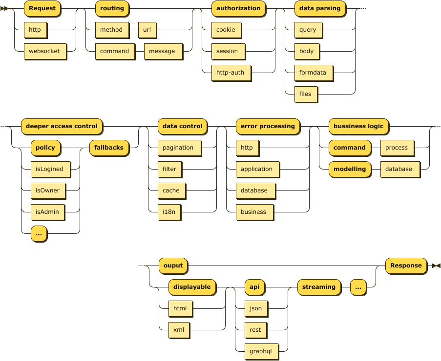

# AEX

[](https://travis-ci.com/calidion/aex)
[](https://coveralls.io/github/calidion/aex?branch=master)
[](http://opensource.org/licenses/MIT)

[![NPM version][npm-image]][npm-url]
[![Downloads][downloads-image]][npm-url]
[![Downloads][downloads-image-month]][npm-url]

## An Object-Oriented Web Framework needs no MVC

```ts
import { Aex, http } from "@aex/core";

class Helloworld {
  public message: string;
  constructor() {
    this.message = "Hello world!";
  }
  @http("/")
  public async all(req: any, res: any) {
    res.end(this.message);
  }
}

const aex = new Aex();
aex.push(Helloworld);
aex.prepare().start(8086);
```

## Intro

A simple, easy to use, decorated, scoped, object-oriented web server, with async linear middlewares and no more callbacks in middlewares.

It can be used as a micro service server and a very large scalable enterprise web server with official or customized decorators plugged-in.

It is a web framework based on typescript and nodejs.

## Philosophy

1. Keep in mind to separate web logic from business logic, and only develope for web logic.
2. Focus soly on web flow.
3. Simplify the way to make good web projects.
4. Consider web interactions as phrased straight lines, which we call it Web Straight Line.
5. No MVC, soly focusing on architecture which is the web logic.

## What is Web Straight Line?

Web Straight Line is used to describe the phrases of the processes on the http/web request.

It can be breifly describe as the following diagram:

> The Web Staight Line



Web Straight Line is a true web server thoery for the web framework (comparing to the MVC thoery which is more suitable for desktop applications), which solves only the problems caused by web (namely the HTTP protocol) itself.

It can be trimmed as a micro service web server or a full-fledged web server by docrating enough constraints using docrators, it is logic scalable by decorators/middlewares.

## Content

1. [Install](#install)
2. [Quick Start](#quick-start)
3. [Framework functions](#framework-functions)
4. [Decorators](#decorators)
5. [Usage with no decorators](#usage-with-no-decorators)
6. [Middlewares](#middlewares)
7. [Scope](#scope)
8. [Helper](#helper)
9. [Express Middleware Integration](#use-middlewares-from-expressjs)
10. [Get the web server](#accessable-members)
11. [Websocket support](#websocket-support)
12. [Upgrade from Expressjs](./docs/upgrade%20from%20expressjs.md)

## Shortcuts for decorators

1. [HTTP method decorators](#1-http-method-decorators) (`@http`, `@get`, `@post`)

2. [Data parsing decorators](#2-data-parsing-decorators) (`@formdata`, `@query`, `@body`)
3. [Static file serving decorators](#3-static-file-serving-decorators) (`@serve`)

4. [Template decorators](#4-template-decorators) (`@template`)

5. [Session management decorators](#5-session-management-decorators) (`@session`)
6. [Data filtering and validation decorators](#6-data-filtering-and-validation-decorators) ( `@filter`)
7. [Error definition decorators](#7-error-definition-decorators) (`@error`)
8. [Custome middleware decorators](#8-custome-middleware-decorators) (`@inject`)

## Shortcuts for helpers

1. [pagination with `paginate` function](#paginate)

## Install

if you use npm

```sh
npm install @aex/core # or npm i @aex/core
```

or if you use yarn

```sh
yarn add @aex/core
```

## Quick Start

1. Use `@http` to enable a class with web ability

   ```ts
   import { Aex, http } from "@aex/core";

   class HelloAex {
     private name = "Alice";
     constructor(name: string) {
       this.name = name;
     }
     @http("*", "*")
     public all(_req: any, res: any, _scope: any) {
       res.end("Hello from " + this.name + "!");
     }
   }
   ```

2. Create an aex instance

   ```ts
   const aex = new Aex();
   ```

3. Push your class to aex with parameters if you

   ```ts
   // push your handler into aex with constructor parameters in order
   aex.push(HelloAex, "Eric");
   ```

4. Prepare aex enviroment

   ```ts
   aex.prepare();
   ```

5. Start aex web server

   ```ts
   aex.start(8080).then();
   // or
   await aex.start(8080);
   ```

### A quick starter for javascript users.

Aex is written in typescript, but it can be very well used with javascript.

You can click [here](https://github.com/aex-ts-node/aex-babel-node-js-starter) to get the starter for javascript developers.

it is located at: https://github.com/aex-ts-node/aex-babel-node-js-starter; You can refer it every time your want to create a new aex project.

## Framework functions

The aex object has many functions for middlewares and classes.

They are:

1. [use](#use) To add a middleware
2. [push](#push) To push a class
3. [prepare](#prepare) To prepare the server
4. [start](#start) To start the server

### use

Add middlewares to aex, see detailed explanations in [middlewares](#middlewares). These middlewares will be global to all http requests.

### push

push a controller class to aex, it takes at lease a class and its constructor's parameters followed by the class.

1. aClass: a class prototype.
2. args: takes the rest arguments for the class constructor

```ts
aex.push(HelloAex);
//or
aex.push(HelloAex, parameter1, parameter2, ..., parameterN);
// will be invoked as `new HelloAlex(parameter1, parameter2, ..., parameterN)`
```

### prepare

`prepare` is used here to init middlewares and request handlers written within use classes after these classes pushed to the `aex` instance. It takes no parameter and return the `aex` instance. so you can invoke the `start` function.

Aex introduces no MVC but the Web Straight Line to relect the flows how http requests are processed.

```ts
await aex.prepare().start();
// or
aex
  .prepare()
  .start()
  .then(() => {
    // further processing
  });
```

### start

`start` function is used to bootstrap the server with cerntain port. It takes three parameters:

1. `port` the port taken by the web server, defaults to 3000
2. `ip` the ip address where the port binds to, defaults to localhost
3. `prepare` prepare middlewares or not, used when middlewares are not previously prepared

## Decorators

Aex is simplified by decorators, so you should be familiar with decorators to fully utilize aex.

Decorators will be enriched over time. Currently aex provides the following decorators:

1. [HTTP method decorators](#1-http-method-decorators) (`@http`, `@get`, `@post`)
2. [Data parsing decorators](#2-data-parsing-decorators) (`@formdata`, `@query`, `@body`)
3. [Static file serving decorators](#3-static-file-serving-decorators) (`@serve`)
4. [Template decorators](#4-template-decorators) (`@template`)
5. [Session management decorators](#5-session-management-decorators) (`@session`)
6. [Data filtering and validation decorators](#6-data-filtering-and-validation-decorators) ( `@filter`)
7. [Error definition decorators](#7-error-definition-decorators) (`@error`)
8. [Custome middleware decorators](#8-custome-middleware-decorators) (`@inject`)

### 1. HTTP method decorators

This decorators are the most basic decorators, all decorators should follow them. They are
`@http` , `@get` , `@post` .

#### `@http` , `@get` , `@post`

`@http` is the generic http method decorator. `@get` , `@post` are the shortcuts for `@http` ;

The `@http` decorator defines your http handler with a member function.

The member methods are of `IAsyncMiddleware` type.

`@http` takes two parameter:

1. http method name(s)
2. url(s);

You can just pass url(s) if you use http `GET` method only or you can use `@get` .

Here is how your define your handlers.

```ts
import { http, get, post } from "@aex/core";

class User {
  @http("get", ["/profile", "/home"])
  profile() {}

  @http(["get", "post"], "/user/login")
  login() {}

  @http("post", "/user/logout")
  logout() {}

  @http("/user/:id")
  info() {}

  @http(["/user/followers", "/user/subscribes"])
  followers() {}

  @get(["/user/get", "/user/gets"])
  rawget() {}

  @post("/user/post")
  rawpost() {}
}
```

### 2. Data parsing decorators

These decorators will parse all data passed thought the HTTP protocol.
They are `@formdata` , `@query` , `@body` .

1. `@formdata` can parse `mulit-part` formdata such as files into `scope.files` and other formdata into `scope.body`. When parsed, you can retrieve your `multi-part` formdata from `scope.files`, `scope.body`.
2. `@query` can parse url query into `scope.query`.
3. `@body` can parse some simple formdata into `scope.body`.

#### `@formdata`

Decorator `@formdata` is a simplified version of node package [`busboy`](https://github.com/mscdex/busboy) for `aex` , only the `headers` options will be auto replaced by `aex` . So you can parse valid options when necesary.
All uploaded files are in array format, and it parses body as well.

```ts
import { http, formdata } from "@aex/core";

class Formdata {
  protected name = "formdata";

  @http("post", "/file/upload")
  @formdata()
  public async upload(_req: any, res: any, scope: any) {
    const { files, body } = scope;

    // Access your files
    const uploadedSingleFile = files["fieldname1"][0];
    const uploadedFileArray = files["fieldname2"];

    // Access your file info

    uploadedSingleFile.temp; // temporary file saved
    uploadedSingleFile.filename; // original filename
    uploadedSingleFile.encoding; // file encoding
    uploadedSingleFile.mimetype; // mimetype

    // Access none file form data
    const value = body["fieldname3"];
    res.end("File Uploaded!");
  }
}
```

#### `@body`

Decorator @body provides a simple way to process data with body parser. It a is a simplified version of node package [body-parser](https://github.com/expressjs/body-parser).

It takes two parameters:

1. types in ["urlencoded", "raw", "text", "json"]
2. options the same as body-parser take.

then be parsed into `scope.body` , for compatibility `req.body` is still available.

Simply put:

```ts
@body("urlencoded", { extended: false })
```

Full example

```ts
import { http, body } from "@aex/core";

class User {
  @http("post", "/user/login")
  @body("urlencoded", { extended: false })
  login() {
    const [, , scope] = arguments;
    const { body } = scope;
  }

  @http("post", "/user/logout")
  @body()
  login() {
    const [, , scope] = arguments;
    const { body } = scope;
  }
}
```

#### `@query`

Decorator @query will parse query for you. After decorated with `@query` you will have `scope.query` to use. `req.query` is available for compatible reasion, but it is discouraged.

```ts
class Query {
  @http("get", "/profile/:id")
  @query()
  public async id(req: any, res: any, _scope: any) {
    // get /profile/111?page=20
    req.query.page;
    // 20
  }
}
```

### 3. Static file serving decorators

Aex provides `@serve` decorator and its alias `@assets` for static file serving.

> Due to `static` is taken as a reserved word for javascript, `static` is not supported.

#### `@serve` and `@assets`

They take only one parameter:

1. url: the base url for your served files.

It is recursive, so place used with caution, don't put your senstive files under that folder.

```ts
import { serve } from "@aex/core";

class StaticFileServer {
  protected name = "formdata";

  @serve("/assets")
  public async upload() {
    // All your files and subdirectories are available for accessing.
    return resolve(__dirname, "./fixtures");
  }

  @assets("/assets1")
  public async upload() {
    // All your files and subdirectories are available for accessing.
    return resolve(__dirname, "./fixtures");
  }
}
```

### 4. Template decorators

Aex provides `@template` decorator for you to customize your template engine.

with `@template` decorator, you can use multiple template engines within one class.

### `@template`

Decorator `@template` takes four parameters:

1. init
   template initializing function that returns an template engine
2. path
   where the templates are located
3. ext
   file extension if necessary, defaults to html
4. options
   options if necessary

Function `init` should return an template engine that has the `render` function.
the `render` function then can be used by the `res` object passed by the middleware.
If the engine has no render function or the parameters are vary from the required `IInitFunction` interface, you should return a new engine with a compatible `render` function.

When the engine is returned, it will be added to `scope`, so you can access it when necessary.

Hence we have two ways to render a template file:

1. use `res.render`
2. use `scope.engine`

The following is an example on how to use `@template` decorator:

#### Access using `res.render`

1. Template name `nunjucks`
2. with compatible `render` function

```typescript
class Template {
  @http("/one")
  @template((path) => {
    const loader = new nunjucks.FileSystemLoader([path], {});
    const env = new nunjucks.Environment(loader, {
      autoescape: false,
    });
    return env;
  }, resolve(__dirname, "./views"))
  public async name(_: any, res: any) {
    // access using res.render
    res.render("index.html", { hello: "Hello" });
  }
}
```

#### access using scope.engine

1. Template name: `pug`
2. with `render` function rewritten

```typescript
class Template {
  @http("/pug")
  @template((path) => {
    const engine: any = {};

    // engine render function rewrite
    engine.render = function (name: string, data: any) {
      let file = name;
      if (!existsSync(name)) {
        if (!existsSync(resolve(path, name))) {
          throw new Error("File Not Found: " + resolve(path, name));
        } else {
          file = resolve(path, name);
        }
      }
      return pug.renderFile(file, data);
    };
    return engine;
  }, resolve(__dirname, "./views"))
  public async name2(_: any, res: any, scope: any) {
    // access using scope.engine
    res.end(scope.engine.render("index.pug", { hello: "Hello3" }));
  }
}
```

> Be sure to remember when using `scope.engine`, you need `res.end` too.

Due to the flexibility aex provides, you can mix then with one class with ease.

```ts
class Template {
  @http("/one")
  @template((path) => {
    const loader = new nunjucks.FileSystemLoader([path], {});
    const env = new nunjucks.Environment(loader, {
      autoescape: false,
    });
    return env;
  }, resolve(__dirname, "./views"))
  public async name(_: any, res: any) {
    // access using res.render
    res.render("index.html", { hello: "Hello" });
  }

  @http("/pug")
  @template((path) => {
    const engine: any = {};

    // engine render function rewrite
    engine.render = function (name: string, data: any) {
      let file = name;
      if (!existsSync(name)) {
        if (!existsSync(resolve(path, name))) {
          throw new Error("File Not Found: " + resolve(path, name));
        } else {
          file = resolve(path, name);
        }
      }
      return pug.renderFile(file, data);
    };
    return engine;
  }, resolve(__dirname, "./views"))
  public async name2(_: any, res: any, scope: any) {
    // access using scope.engine
    res.end(scope.engine.render("index.pug", { hello: "Hello3" }));
  }
}
```

### 5. Session management decorators

Aex provides `@session` decorator for default cookie based session management.
Session in other format can be realized with decorator `@inject` .

#### `@session`

Decorator `@session` takes a store as the parameter. It is an object derived from the abstract class ISessionStore. which is defined like this:

```ts
export declare abstract class ISessionStore {
  abstract set(id: string, value: any): any;
  abstract get(id: string): any;
  abstract destroy(id: string): any;
}
```

`aex` provides two default store: `MemoryStore` and `RedisStore` .
`RedisStore` can be configurated by passing options through its constructor. The passed options is of the same to the function `createClient` of the package `redis` . You can check the option details [here](https://github.com/NodeRedis/node-redis#options-object-properties)

For `MemoryStore` , you can simply decorate with `@session()` .
For `RedisStore` , you can decorate with an RedisStore as `@session(redisStore)` . Be sure to keep the variable redisStore global, because sessions must share only one store.

```ts
// Must not be used @session(new RedisStore(options)).
// For sessions share only one store over every request.
// There must be only one object of the store.
const store = new RedisStore(options);
class Session {
  @post("/user/login")
  @session()
  public async get() {
    const [, , scope] = arguments;
    const { session } = scope;
    session.user = user;
  }

  @get("/user/profile")
  @session()
  public async get() {
    const [, , scope] = arguments;
    const { session } = scope;
    const user = session.user;
    res.end(JSON.stringify(user));
  }

  @get("/user/redis")
  @session(store)
  public async get() {
    const [, , scope] = arguments;
    const { session } = scope;
    const user = session.user;
    res.end(JSON.stringify(user));
  }
}
```

> Share only one store object over requests.

### 6. Data filtering and validation decorators

Aex provides `@filter` to filter and validate data for you.

#### `@filter`

Decorator `@filter` will filter `body` , `params` and `query` data for you, and provide fallbacks respectively for each invalid data processing.

If the filtering rules are passed, then you will get a clean data from `scope.extracted`.

You can access `scope.extracted.body`, `scope.extracted.params` and `scope.extracted.query` if you filtered them.

But still you can access `req.body`, `req.query`, `req,params` after filtered.

Reference [node-form-validator](https://github.com/calidion/node-form-validator) for detailed usage.

```ts
class User {
  private name = "Aex";
  @http("post", "/user/login")
  @body()
  @filter({
    body: {
      username: {
        type: "string",
        required: true,
        minLength: 4,
        maxLength: 20
      },
      password: {
        type: "string",
        required: true,
        minLength: 4,
        maxLength: 64
      }
    },
    fallbacks: {
      body: async(error, req, res, scope) {
        res.end("Body parser failed!");
      }
    }
  })
  public async login(req: any, res: any, scope: any) {
    // req.body.username
    // req.body.password
    // scope.extracted.body.username
    // scope.extracted.body.password
    // scope.extracted is the filtered data
  }

  @http("get", "/profile/:id")
  @body()
  @query()
  @filter({
    query: {
      page: {
        type: "numeric",
        required: true
      }
    },
    params: {
      id: {
        type: "numeric",
        required: true
      }
    },
    fallbacks: {
      params: async function (this: any, _error: any, _req: any, res: any) {
        this.name = "Alice";
        res.end("Params failed!");
      },
    }
  })
  public async id(req: any, res: any, _scope: any) {
    // req.params.id
    // req.query.page
  }
}
```

### 7. Error definition decorators

Aex provides `@error` decorator for error definition

#### @error

Decorator `@error` will generate errors for you.

Reference [errorable](!https://github.com/calidion/errorable) for detailed usage.

`@error` take two parameters exactly what function `Generator.generate` takes.

Besides you can add `lang` attribut to `@error` to default the language, this feature will be automatically removed by `aex` when generate errors.
With the lang attribute, you can new errors without specifying a language every time throw/create an error;

```ts
class User {
  @http("post", "/error")
  @error({
    lang: "zh-CN",
    I: {
      Love: {
        You: {
          code: 1,
          messages: {
            "en-US": "I Love U!",
            "zh-CN": "我爱你！",
          },
        },
      },
    },
    Me: {
      alias: "I",
    },
  })
  public road(_req: any, res: any, scope: any) {
    const [, , scope] = arguments;
    const { error: e } = scope;
    const { ILoveYou } = e;
    throw new ILoveYou("en-US");
    throw new ILoveYou("zh-CN");
    throw new ILoveYou(); // You can ignore language becuase you are now use the default language.
    res.end("User Error!");
  }
}
```

### 8. Custome middleware decorators

Aex provides `@inject` decorator for middleware injection.

`@inject` decrator takes two parameters:

1. injector: the main injected middleware for data further processing or policy checking
2. fallback: optional fallback when the injector fails and returned `false`

```ts
class User {
  private name = "Aex";
  @http("post", "/user/login")
  @body()
  @inject(async () => {
      req.session = {
        user: {
          name: "ok"
        }
      };
  })
  @inject(async function(this:User, req, res, scope) {
      this.name = "Peter";
      req.session = {
        user: {
          name: "ok"
        }
      };
  })
  @inject(async function(this:User, req, res, scope) => {
      this.name = "Peter";
      if (...) {
        return false
      }
  }, async function fallback(this:User, req, res, scope){
    // some fallback processing
    res.end("Fallback");
  })
  public async login(req: any, res: any, scope: any) {
    // req.session.user.name
    // ok
    ...
  }
}
```

## Usage with no decorators

1. Create an Aex instance

   ```ts
   const aex = new Aex();
   ```

2. Create a Router

   ```ts
   const router = new Router();
   ```

3. Setup the option for handler

   ```ts
   router.get("/", async () => {
     // request processing time started
     console.log(scope.time.stated);
     // processing time passed
     console.log(scope.time.passed);
     res.end("Hello Aex!");
   });
   ```

4. Use router as an middleware

   ```ts
   aex.use(router.toMiddleware());
   ```

5. Start the server

   ```ts
   const port = 3000;
   const host = "localhost";
   const server = await aex.start(port, host);
   // server === aex.server
   ```

## Websocket support

### Simple example

1. Create a `WebSocketServer` instance

   ```ts
   const aex = new Aex();
   const server = await aex.start();
   const ws = new WebSocketServer(server);
   ```

2. Get handler for one websocket connection

   ```ts
   ws.on(WebSocketServer.ENTER, (handler) => {
     // process/here
   });
   ```

3. Listen on user-customized events

   ```ts
   ws.on(WebSocketServer.ENTER, (handler) => {
     handler.on("event-name", (data) => {
       // data.message = "Hello world!"
     });
   });
   ```

4. Send message to browser / client

   ```ts
   ws.on(WebSocketServer.ENTER, (handler) => {
     handler.send("event-name", { key: "value" });
   });
   ```

5. New browser/client WebSocket object

   ```ts
   const wsc: WebSocket = new WebSocket("ws://localhost:3000/path");
   wsc.on("open", function open() {
     wsc.send("");
   });
   ```

6. Listen on user-customized events

   ```ts
   ws.on("new-message", () => {
     // process/here
   });
   ```

7. Sending ws message in browser/client

   ```ts
   const wsc: WebSocket = new WebSocket("ws://localhost:3000/path");
   wsc.on("open", function open() {
     wsc.send(
       JSON.stringify({
         event: "event-name",
         data: {
           message: "Hello world!",
         },
       })
     );
   });
   ```

8. Use websocket middlewares

   ```ts
   ws.use(async (req, ws, scope) => {
     // return false
   });
   ```

## Middlewares

Middlewares are defined like this:

```ts
export type IAsyncMiddleware = (
  req: Request,
  res: Response,
  scope?: Scope
) => Promise<boolean | undefined | null | void>;
```

They return promise. so they must be called with `await` or `.then()`.

### Global middlewares

Global middlewares are effective all over the http request process.

They can be added by `aex.use` function.

```ts
aex.use(async () => {
  // process 1
  // return false
});

aex.use(async () => {
  // process 2
  // return false
});

// ...

aex.use(async () => {
  // process N
  // return false
});
```

> Return `false` in middlewares will cancel the whole http request processing  
> It normally happens after a `res.end`

### Handler specific middlewares

Handler specific middlewares are effective only to the specific handler.

They can be optionally added to the handler option via the optional attribute `middlewares` .

the `middlewares` attribute is an array of async functions of `IAsyncMiddleware` .

so we can simply define handler specific middlewares as follows:

```ts
router.get(
  "/",
  async () => {
    res.end("Hello world!");
  },
  [
    async () => {
      // process 1
      // return false
    },
    async () => {
      // process 2
      // return false
    },
    // ...,
    async () => {
      // process N
      // return false
    },
  ]
);
```

### Websocket middlewares

Websocket middlewares are of the same to the above middlewares except that the parameters are of different.

```ts
type IWebSocketAsyncMiddleware = (
  req: Request,
  socket: WebSocket,
  scope?: Scope
) => Promise<boolean | undefined | null | void>;
```

The Websocket Middlewares are defined as `IWebSocketAsyncMiddleware` , they pass three parameters:

1. the http request
2. the websocket object
3. the scope object

THe middlewares can stop websocket from further execution by return `false`

## Accessable members

### server

The node system `http.Server` .

Accessable through `aex.server` .

```ts
const aex = new Aex();
const server = await aex.start();
expect(server === aex.server).toBeTruthy();
server.close();
```

## Scope

Aex provides scoped data for global and local usage.

A scope object is passed by middlewares and handlers right after `req` , `res` as the third parameter.

It is defined in `IAsyncMiddleware` as the following:

```ts
async () => {
  // process N
  // return false
};
```

the `scope` variable has 8 native attributes: `time` , `outer` , `inner` , `query` , `params` , `body` , `error` , `debug`

The `time` attribute contains the started time and passed time of requests.
The `outer` attribute is to store general or global data.
The `inner` attribute is to store specific or local data.
The `query` attribute is to store http query.
The `body` attribute is to store http body.
The `params` attribute is to store http params.
The `error` attribute is to store scoped errors.
The `debug` attribute is to provide handlers the debugging ability.

### `time`

#### Get the requesting time

```ts
scope.time.started;
// 2019-12-12T09:01:49.543Z
```

#### Get the passed time

```ts
scope.time.passed;
// 2019-12-12T09:01:49.543Z
```

### `outer` and `inner`

The `outer` and `inner` variables are objects used to store data for different purposes.

You can simply assign them a new attribute with data;

```ts
scope.inner.a = 100;
scope.outer.a = 120;
```

### `debug`

`debug` is provided for debugging purposes.

It is a simple import of the package `debug` .

Its usage is of the same to the package `debug` , go [debug](https://github.com/visionmedia/debug) for detailed info.

Here is a simple example.

```ts
async () => {
  const { debug } = scope;
  const logger = debug("aex:scope");
  logger("this is a debugging info");
};
```

## all these build-in attribute are readonly

```ts
// scope.outer = {};  // Wrong operation!
// scope.inner = {};   // Wrong operation!
// scope.time = {};    // Wrong operation!
// scope.query = {};    // Wrong operation!
// scope.params = {};    // Wrong operation!
// scope.body = {};    // Wrong operation!
// scope.error = {};    // Wrong operation!
// scope.debug = {};    // Wrong operation!
// scope.time.started = {};  // Wrong operation!
// scope.time.passed = {};   // Wrong operation!
```

## Helpers

Helpers are special middlewares with parameters to ease some fixed pattern with web development.

They must work with decorator `@inject`.

The first aviable helper is `paginate`.

### paginate

Helper `paginate` can help with your pagination data parsing and filtering. It gets the correct value for you, so you can save your code parsing and correcting the pagination data before using them.

#### paramters

`paginate` is function takes two parameter:

1. `limit` is the default value of limitation for pagination, if the request is not specified. This function defaults it to `20`, so you your request doesn't specific a value to `limit`, it will be assigned `20`.

2. `type` is the type data you use for pagination, it can be `body`, `params`, `query`. `query` is the default one. Before use `paginate`, you must parsed your data. For if you use `body` for pagination, normally your reuqest handlers should be deocrated with `@body`. Becuase params are parsed internally, using params needs no docrator.
   The data to be parsed must contain two parameters which should be named with : `page`, `limit`.
   for type `query`, pagination data can be : `list?page=2&limit=30`;

#### usage

After parsing, `scope` will be added a attribute `pagination`, which is a object have three attribute: `page`, `limit`, `offset`. so you can simply extract them with

```ts
const {
  pagination: { page, limit, offset },
} = scope;
```

Here is how to use helper `paginate`.

```ts
class Paginator {
  @http('/page/query')
  @query()
  @inject(paginate(10, 'query'))
  async public pageWithQuery() {
    const [, , scope] = arguments;
    const {pagination: {page, limit, offset}} = scope;

    ...
  }

  @http('/page/body')
  @body()
  @inject(paginate(10, 'body'))
  async public pageWithBody() {
    const [, , scope] = arguments;
    const {pagination: {page, limit, offset}} = scope;

    ...
  }

  @http('/page/params/:page/:limit')
  @body()
  @inject(paginate(10, 'body'))
  async public pageWithParams() {
    const [, , scope] = arguments;
    const {pagination: {page, limit, offset}} = scope;

    ...
  }
}
```

## Use middlewares from expressjs

Aex provide a way for express middlewares to be translated into Aex middlewares.

You need just a simple call to `toAsyncMiddleware` to generate Aex's async middleware.

```ts
const oldMiddleware = (_req: any, _res: any, next: any) => {
  // ...
  next();
};

const pOld = toAsyncMiddleware(oldMiddleware);
aex.use(pOld);
```

> You should be cautious to use express middlewares.
> Full testing is appreciated.

## Tests

```sh
npm install
npm test
```

## Effective Versioning

Aex follows a general versioning called [Effective Versioning](https://github.com/calidion/effective-versioning).

## All lives matter

Aex supports human equality in law of rights only and supports human diversity in other area. Humans will never be equal in most area which is law of nature.

## Lincense

MIT

[downloads-image]: http://img.shields.io/npm/dt/@aex/core.svg
[downloads-image-month]: http://img.shields.io/npm/dm/@aex/core.svg
[npm-image]: https://img.shields.io/npm/v/@aex/core.svg
[npm-url]: https://npmjs.org/package/@aex/core
[daviddm-image]: https://david-dm.org/calidion/aex.svg?theme=shields.io
[daviddm-url]: https://david-dm.org/calidion/aex
